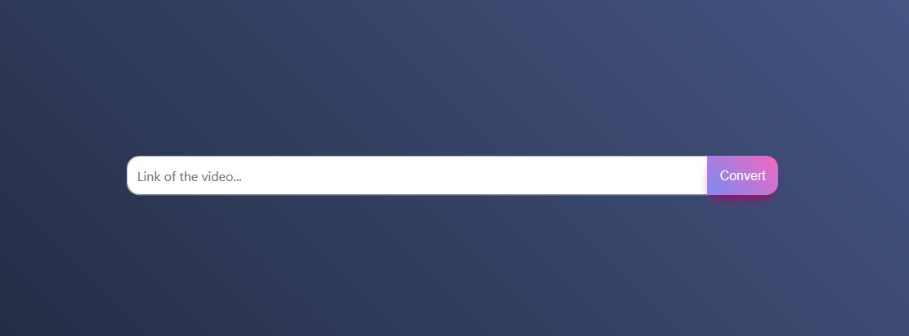

# keyring
A mutliwebsite video downloader.


## Authors

Made by Labrak Yanis.

## Getting Started

```bash
git clone https://github.com/qanastek/keyring.git
nodemon server.js
```

## Run unit tests

```bash
npm test
```

## Informations

Currently work with :

| Website      | 🎬 Videos  | 🌁 Images |
| ---------    |:----------:| ----------:|
| Instagram    | ✓          |            |
| Facebook     |            |            |
| Twitter      |            |            |
| Youtube      |            |            |
| VK           |            |            |
| Vine         |            |            |
| Vimeo        |            |            |
| Tumblr       |            |            |
| TED          |            |            |
| Dailymotion  |            |            |
| QQ           |            |            |
| TikTok       |            |            |

http://v.qq.com/

## Pictures



## Todo:
- [ ] Front end verification (jquery validate)
	- [x] Everything is fill up
	- [x] Check domain ect ...
	- [ ] Check if its an image or not
- [ ] Work this every single website above
- [ ] Finish both UI
- [ ] Make it more secure by adding more input condition
- [ ] Test
	- [ ] Fuzzing
	- [ ] Unit testing
		- [ ] SuperTest
	- [ ] UI testing (maybe ?)
- [ ] Draw the Architecture

Todo V2:
- [ ] Add multi downloading in one time
- [ ] Add image downloader
	- [ ] Choose ouput extension

## Similar GitHub projects:

* https://github.com/soimort/you-get
* https://github.com/iawia002/annie
* https://github.com/rylio/ytdl
